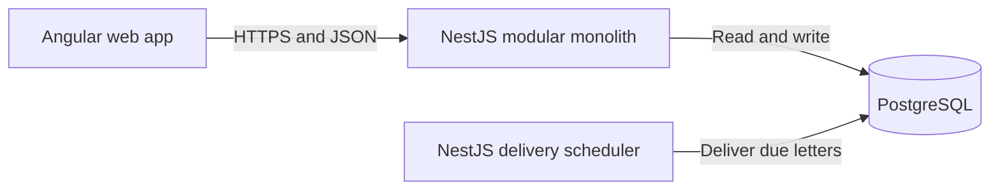

# PenPal

PenPal is a slow, letter-based language exchange application. Instead of instant messaging, matched members exchange thoughtful letters that arrive after a configurable delivery delay.

## MVP goal

Deliver the smallest usable product quickly for an initial community of roughly 50 people:

- registration and login;
- member onboarding;
- a manual matching pool operated by an administrator;
- one active pen-pal match per member;
- composing and sending delayed letters;
- received and sent mailboxes;
- reading and replying to delivered letters.

Tokens (in-app points/credits used to unlock actions—for example, spending 3 tokens to request a new pen pal), vocabulary statistics, rematching, attachments, automatic matching and multiple simultaneous pen pals are intentionally postponed.

## Technology

- Angular web application using SpartanUI libraries
- NestJS API
- PostgreSQL
- Nx monorepo
- DDD with feature-based layered architecture
- REST with an OpenAPI-generated Angular client

## Architecture at a glance

PenPal starts as one modular monolith. Business capabilities are separated into NestJS modules and Angular features, but they are deployed together. PostgreSQL is also used to persist delayed-delivery state; no message broker is required for the MVP.



## Documentation

Start with the [documentation index](docs/README.md).

- [Product scope](docs/01-product-scope.md)
- [Domain model and glossary](docs/02-domain-model.md)
- [Use cases and business rules](docs/03-use-cases.md)
- [Architecture](docs/04-architecture.md)
- [Data model](docs/05-data-model.md)
- [API conventions](docs/06-api.md)
- [Security and privacy](docs/07-security-and-privacy.md)
- [Testing strategy](docs/08-testing-strategy.md)
- [Delivery roadmap](docs/09-delivery-roadmap.md)
- [Architecture decisions](docs/decisions/README.md)

## Local development

The commands below are placeholders until the workspace is generated:

```bash
pnpm install
pnpx nx serve api
pnpx nx serve frontend
```

Required local services:

- PostgreSQL

Configuration must be provided through environment variables. A committed `.env.example` should document required keys without containing secrets.

## Feedback workflow

Architecture and scope changes should be proposed through a pull request. Larger unresolved questions should become GitHub issues and link back to the affected document.

## Documentation rule

Documentation is part of the product. A pull request that changes a business rule, API contract, module boundary or persistent state should update the corresponding document in the same pull request.
